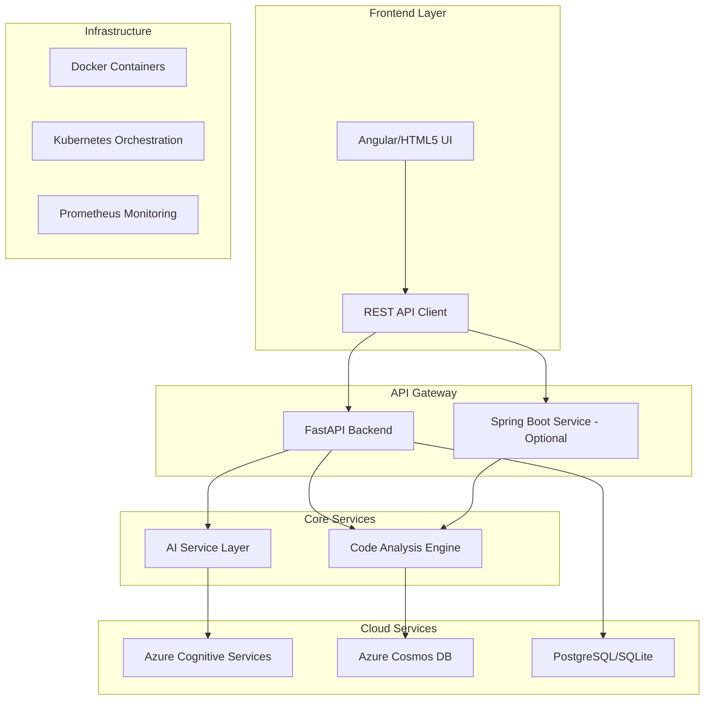

AI Code Review Assistant 🤖

An enterprise-grade AI-powered code review assistant that provides intelligent analysis, security vulnerability detection, and actionable improvement suggestions for Python, Java, and JavaScript/TypeScript code.

🌟 Features
Core Capabilities
🔍 Multi-Language Support: Comprehensive analysis for Python, Java, JavaScript/TypeScript
🛡️ Security Analysis: Detection of common vulnerabilities (eval, SQL injection, XSS)
📊 Code Quality Metrics: Cyclomatic complexity, maintainability index, lines of code
🤖 AI-Powered Suggestions: Intelligent recommendations using Azure Cognitive Services
⚡ Real-time Analysis: Fast, async processing with FastAPI
📈 Historical Tracking: SQLite/PostgreSQL database for review history
📚 RESTful API: Well-documented endpoints with OpenAPI/Swagger
☁️ Cloud-Ready: Integrated with Azure services and ready for cloud deployment
Technical Highlights
Modern Python stack with FastAPI, Pydantic, SQLAlchemy
Microservices architecture with Docker and Kubernetes
Comprehensive test coverage with pytest
CI/CD pipeline with GitHub Actions
Prometheus metrics integration
Auto-scaling with Kubernetes HPA

🚀 Quick Start
Prerequisites
Python 3.11+
Docker & Docker Compose
Git
Local Development
Clone the repository
bash
git clone https://github.com/yourusername/ai-code-review.git
cd ai-code-review
Set up environment
bash
cd backend/python-service
cp .env.example .env
# Edit .env with your configuration
Install dependencies
bash
python -m venv venv
source venv/bin/activate  # On Windows: venv\Scripts\activate
pip install -r requirements.txt
Run the application
bash
uvicorn app.main:app --reload --host 0.0.0.0 --port 8000
Access the application
Frontend: Open frontend/index.html in your browser
API Docs: http://localhost:8000/api/docs
Health Check: http://localhost:8000
Docker Deployment
bash
cd backend
docker-compose up -d
📚 API Documentation
Core Endpoints
Analyze Code
http
POST /api/v1/analyze
Content-Type: application/json

{
  "code": "def hello():\n    return 'Hello, World!'",
  "language": "python",
  "filename": "hello.py",
  "enable_ai": true
}
Get Review History
http
GET /api/v1/history?skip=0&limit=10&language=python
Get Metrics Summary
http
GET /api/v1/metrics/summary
Full API documentation available at /api/docs when running the application.

🧪 Testing
bash
# Run tests
pytest tests/ -v --cov=app --cov-report=html

# Run linting
flake8 app/ --max-line-length=100
black app/ --check
🐳 Docker & Kubernetes
Build and Run with Docker
bash
docker build -t code-analyzer:latest backend/python-service/
docker run -p 8000:8000 code-analyzer:latest
Deploy to Kubernetes
bash
kubectl apply -f k8s/
🔐 Security Features
Input validation and sanitization
Protection against common vulnerabilities (SQL injection, XSS, command injection)
Secure configuration management
API rate limiting
CORS configuration
📊 Performance Optimizations
Asynchronous request handling
Database connection pooling
Redis caching (optional)
Horizontal scaling with Kubernetes
Load balancing with nginx
🛠️ Technology Stack
Backend
Language: Python 3.11+
Framework: FastAPI
Database: SQLAlchemy with SQLite/PostgreSQL
Validation: Pydantic
Testing: pytest, pytest-asyncio
Frontend
Framework: Angular 15+ / Vanilla JavaScript
Styling: Bootstrap 5, Custom CSS
Icons: Font Awesome
Infrastructure
Containerization: Docker
Orchestration: Kubernetes
CI/CD: GitHub Actions
Monitoring: Prometheus
Cloud: Azure (Cognitive Services, Cosmos DB)
🤝 Contributing
Fork the repository
Create your feature branch (git checkout -b feature/AmazingFeature)
Commit your changes (git commit -m 'Add some AmazingFeature')
Push to the branch (git push origin feature/AmazingFeature)
Open a Pull Request
📈 Roadmap
 Add support for more languages (C++, Go, Rust, C#)
 Real-time collaborative code review
 Integration with GitHub/GitLab/Bitbucket
 VS Code and IntelliJ IDEA plugins
 Machine learning model training for better suggestions
 GraphQL API support
 Mobile application
👥 Author
Shivraj Patil

LinkedIn: linkedin.com/in/shivrajpatil254
Email: shivpatil55123@gmail.com
📄 License
This project is licensed under the MIT License - see the LICENSE file for details.

🙏 Acknowledgments
FastAPI for the excellent web framework
The Python Software Foundation
Azure for cloud services
The open-source community
Note: This is a portfolio project demonstrating enterprise-level development skills. For production deployment, additional security hardening and performance optimization would be recommended.

